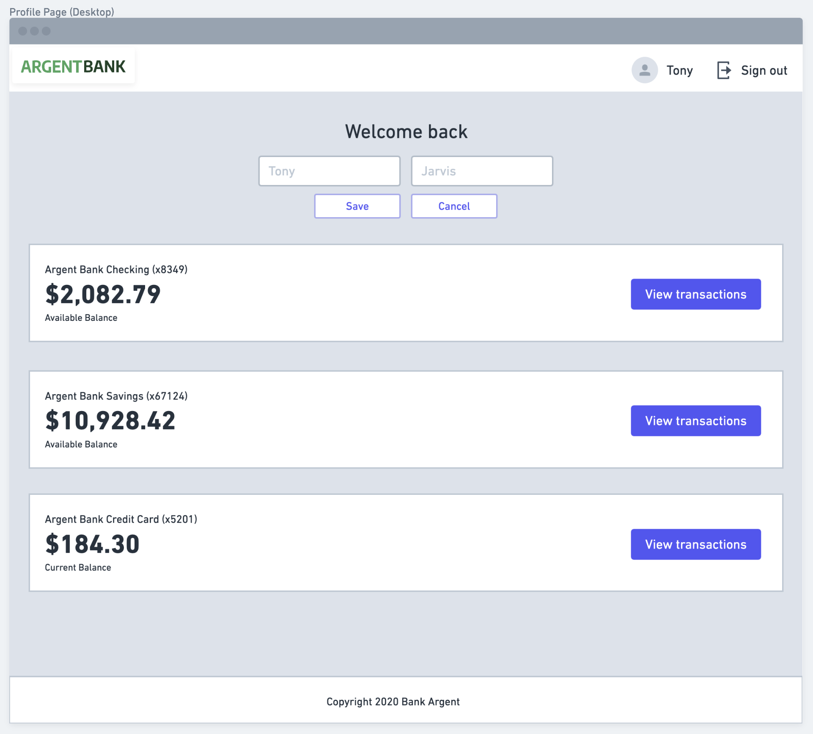

<a name="readme-top"></a>

<!-- PROJECT LOGO -->
<br />
<div align="center">
  <a href="">
    
  </a>
</div>

<!-- TABLE OF CONTENTS -->
<details>
  <summary>Table des matières</summary>
  <ol>
    <li><a href="#a-propos-du-projet">À propos du projet</a></li>
    <li><a href="#technologies-utilisees">Technologies utilisées</a></li>
    <li><a href="#installation">Installation</a></li>
    <li><a href="#utilisation">Utilisation</a></li>
    <li><a href="#documentation-api">Documentation API</a></li>
    <li><a href="#contact">Contact</a></li>
  </ol>
</details>

<!-- ABOUT THE PROJECT -->
## À propos du projet

**ArgentBank** est le projet 13/14 de ma formation OpenClassroom.

### Mission :
En tant que développeur chez **Remede Agency**, une agence spécialisée dans le développement d'applications web, vous avez un nouveau projet :  Il concerne une nouvelle banque qui démarre, Argent Bank, qui essaie de percer dans le secteur et qui a besoin d'aide pour mettre en place son application.

Un contrat en deux parties qui se décompose en plusieurs phases :

- **Phase 1** : Authentification des utilisateurs - Création d'une application web permettant aux clients de se connecter et de gérer leurs comptes et leur profil.
- **Phase 2** : Transactions - Il s’agirait de spécifier les endpoints d’API nécessaires pour une éventuelle deuxième mission une fois que nous aurons terminé la première.

### Particularités :
- **Documentation complète** avec un ReadMe, **JSDoc**, et des **PropTypes** pour une meilleure collaboration au sein de l'équipe.
- Interface utilisateur réactive et intuitive.



## Technologies utilisées

[](https://vitejs.dev/)
[](https://reactjs.org/)
[](https://redux.js.org/)
[](https://nodejs.org/)
[](https://www.mongodb.com/)
[](https://swagger.io/)

## Installation

### Étapes pour configurer le projet :

1. **Cloner le dépôt du projet** :
   ```bash
   git clone https://github.com/AurelieDuynslaeger/ABank-app-Redux-OCR-p13.git
   ```

2. **Cloner le dépôt de l'API** et suivre le ReadMe pour démarrer le serveur backend :
   ```bash
   git clone https://github.com/OpenClassrooms-Student-Center/Project-10-Bank-API.git
   ```

3. **Installer les dépendances du projet** :
   ```bash
   npm install
   ```

4. **Lancer l'application en mode développement** :
   ```bash
   npm run dev
   ```

### Gestion des données
- Assurez-vous que le serveur backend est en cours d'exécution avant d'accéder à l'application.

## Utilisation
- Après avoir lancé l'application, ouvrez votre navigateur à l'adresse `http://localhost:3000`.
- Connectez-vous avec vos identifiants pour accéder à l'interface de gestion de votre compte.

## Documentation API
- La documentation de l'API est disponible [ici](http://localhost:3001/api-docs) lorsque le serveur backend est en cours d'exécution. Utilisez Swagger pour explorer les endpoints disponibles et tester les requêtes.

## Contact
- Aurélie D. - [GitHub](https://github.com/AurelieDuynslaeger)


